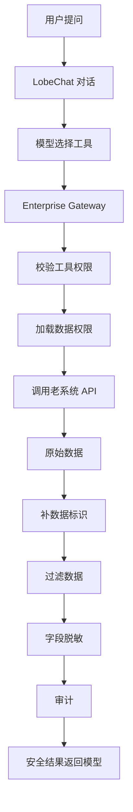
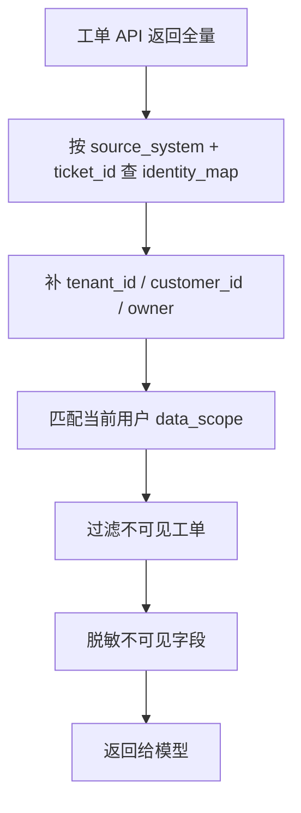

# LobeChat 企业中间层改造计划

## Summary

在 `/Users/gongzhiyong/go/lobehub` 保留 LobeChat 原生对话、Agent、工具、知识库、沙盒、AI 搜索能力，只增加一层 **Enterprise Gateway 企业中间层**，用于接入 Casdoor、Azure 资源和你们现有老系统。

核心原则：

- 对话里不允许管理权限。
- 客户没有管理员角色。
- 权限配置只在后台管理页完成。
- LobeChat 前端只展示“当前用户已授权能力”。
- 所有企业工具调用必须走 Enterprise Gateway。
- 老系统 API 返回全量数据时，由 Gateway 统一打标、过滤、脱敏、审计后再给模型。
- 第一版不重做传统运营后台，只做权限、工具、数据安全层。

## Key Changes

### 1. Casdoor 登录与用户身份

- 使用 LobeChat 已有 OIDC 能力接入 Casdoor，配置 `AUTH_GENERIC_OIDC_*`。
- Casdoor 只保存粗角色：
  - `super_admin`
  - `permission_admin`
  - `internal_sales`
  - `internal_ops`
  - `internal_tech`
  - `customer`
- LobeChat 后端在用户请求时解析 Casdoor token，映射成本地企业用户身份。
- 细粒度工具权限、数据权限、字段权限不放 Casdoor，放 Azure PostgreSQL。

### 2. Enterprise Gateway

新增 LobeChat 后端企业中间层，统一处理：

- 工具注册
- 工具权限校验
- 数据权限校验
- 老系统 API 调用
- 数据标识补全
- 数据过滤
- 字段脱敏
- 审计日志
- Azure Redis 缓存

推荐服务位置：

```text
src/server/services/enterprise/*
src/server/routers/enterprise/*
src/services/enterprise/*
```

所有企业工具统一走：

```text
/api/enterprise/tools/call
```

工具调用流程：



### 3. 权限数据模型

在 Azure PostgreSQL 新增企业权限表：

```text
enterprise_users
enterprise_roles
enterprise_user_roles
enterprise_tool_registry
enterprise_tool_permissions
enterprise_data_scopes
enterprise_field_policies
enterprise_identity_map
enterprise_audit_logs
```

最小权限判断：

```text
用户能不能调用这个工具？
用户能不能看这条数据？
用户能不能看这个字段？
```

工具权限示例：

```text
kb.search
ai_search.web
sandbox.run
doc.generate

gongdan.search_tickets
gongdan.get_ticket
gongdan.create_ticket
gongdan.get_own_tickets

xiaoshou.search_customers
xiaoshou.get_customer
xiaoshou.get_customer_insight
xiaoshou.get_allocations

cloudcost.get_overview
cloudcost.get_daily_report
cloudcost.get_billing_detail
```

角色默认工具：

```text
customer:
  kb.search
  ai_search.web
  sandbox.run
  doc.generate
  gongdan.create_ticket
  gongdan.get_own_tickets

internal_sales:
  xiaoshou.search_customers
  xiaoshou.get_customer
  xiaoshou.get_customer_insight
  xiaoshou.get_allocations
  kb.search
  ai_search.web

internal_ops:
  gongdan.search_tickets
  gongdan.get_ticket
  cloudcost.get_overview
  cloudcost.get_daily_report
  xiaoshou.search_customers
  kb.search
  doc.generate

internal_tech:
  gongdan.get_ticket
  kb.search
  ai_search.web
  sandbox.run
  doc.generate

permission_admin:
  企业权限后台
  用户授权
  工具授权
  数据范围授权
  审计查看

super_admin:
  全部
```

### 4. 老系统数据标识与过滤

对无法修改 API 的老系统，使用 `enterprise_identity_map` 做外部数据映射：

```text
source_system
entity_type
source_entity_id
tenant_id
customer_id
owner_user_id
department_id
sales_user_id
operation_user_id
region
visibility_level
metadata
```

工单系统返回全量时：



如果某条老数据没有映射：

- 客户角色默认不可见。
- 内部角色默认不可见，除非 `super_admin` 或显式配置了兜底范围。
- 审计日志记录 `missing_identity_map`，方便后续补映射。

### 5. Azure 资源使用

- Azure Container Apps / Web App：部署 LobeChat。
- Azure PostgreSQL：企业权限、数据映射、审计。
- Azure Redis：权限策略缓存、Casdoor 用户缓存、外部 token 缓存。
- Azure Storage Account：文件、知识库文件、生成文档。
- Azure Service Bus：异步审计、长任务、数据同步、映射补全任务。
- Azure App Settings / Key Vault：Casdoor secret、工单 API Key、销售 API Key、CloudCost client secret、Jina、Daytona、文档 Agent 密钥。
- Azure OpenAI：LobeChat 模型服务。
- Azure AI Search：企业知识库检索。
- Azure Monitor / App Insights：工具调用、错误、延迟监控。

## Implementation Plan

> **状态图例**：✅ 已完成 · 🟡 部分完成 · ⬜ 未开始 · 🚫 不做（有替代方案）

### Phase 1: 企业权限骨架

- ✅ 接入 Casdoor OIDC 代码就绪（`gateway/src/auth/casdoor.ts` JWKS 验证 + `CASDOOR_ROLE_MAP`；**Casdoor 后台 Application 仍需人工建**，见 `docs/CASDOOR-SETUP.md`）。
- ✅ 企业用户、角色、工具注册、工具权限、数据权限、字段策略、身份映射、审计 9 张表（`gateway/prisma/schema.prisma`）。
- ✅ Enterprise Gateway 服务（Fastify，独立容器 `gateway/`，**偏离原计划"内嵌 Next.js"**——实际更干净，LobeChat 可换、gateway 不动）。
- 🟡 `getMyEnterpriseCapabilities` 接口未按此命名落地；**等价物是 `GET /api/lobechat/manifest`**——按身份返回工具子集，LobeChat 原生插件层直接消费。前端"我的能力清单"页面未做。
- ✅ 前端隐藏未授权工具（更严格：动态 manifest 直接不下发，而非"隐藏"）。

### Phase 2: 客户可用能力

客户可见工具：

- ✅ `kb.search`
- ✅ `ai_search.web`
- ✅ `sandbox.run`
- ✅ `doc.generate`
- ✅ `gongdan.create_ticket`
- ✅ `gongdan.get_own_tickets`

> 最初 seed 里 customer 只绑了前 3 个，**本轮已补齐全 6 件套**（`gateway/prisma/seed.ts` ROLE_TOOL_GRANTS.customer）。

所有工具均强制经 Gateway，前端无直连路径。

### Phase 3: 内部能力

- ✅ 销售（`internal_sales`）：xiaoshou×4 + kb + ai_search + doc。
- ✅ 运营（`internal_ops`）：gongdan×7 + cloudcost×3（**含本轮新增 `get_billing_detail`**）+ kb + ai_search + doc。
- ✅ 技术（`internal_tech`）：gongdan.{get_own_tickets, search_tickets, get_ticket, update_ticket} + kb + ai_search + sandbox。

每个工具的配置落地方式（对应原计划字段）：

| 原计划字段 | 实际落地位置 |
|---|---|
| `tool_key` | `enterprise_tool_registry.key` |
| `required_role` | `enterprise_tool_permissions`（role 级 allow 记录） |
| `data_scope_type` | `enterprise_data_scopes.scope`（DSL：`$self`/`$in`/`$contains`/`$regex`） |
| `field_policy` | `enterprise_field_policies`（drop/mask/hash + 通配） |
| `external_service_client` | `gateway/src/tools/<adapter>.ts` |
| `audit_enabled` | 默认开启；BullMQ 异步队列，写失败同步兜底 |

### Phase 4: 权限后台

- ✅ 只给 `permission_admin` 和 `super_admin` 的 6 页 UI（`gateway/src/routes/admin/ui.ts`，带 CSRF 双提交）：
  - ✅ 企业用户（`/admin/users`）
  - ✅ 角色绑定（通过 `POST /api/admin/users/:id/roles`）
  - ✅ 工具授权（`/admin/tools`）
  - ✅ 数据范围（`/admin/scopes`）
  - ⬜ **知识库范围**——未做。当前 kb 工具 `applyFilter:false`，权限由 kb 上游或 Casdoor grant 管。
  - ✅ 审计日志（`/admin/audit`）
- ✅ 对话里杜绝权限工具：`gateway.ts:43-55` 硬编码拦截 `admin.*` 前缀。

### Phase 5: 删除不需要的前端展示

**实现方式不是"删"而是"隐藏"**（好处：合并上游零冲突；代价：dead code 还在）：

- ✅ LobeHub 社区/发现入口 —— `/discover` → `/` 永久重定向（`src/libs/next/config/define-config.ts`）
- ✅ 模型广场 —— FEATURE_FLAGS: `-market`
- ✅ 官方市场推广 —— `NEXT_PUBLIC_MARKET_BASE_URL=''`（`src/services/marketApi.ts:230-235`）
- ✅ LobeChat Cloud 订阅 —— FEATURE_FLAGS: `-cloud_promotion,-changelog`
- 🟡 普通客户的模型供应商配置 —— 未禁用（客户目前仍能自己配 OPENAI_KEY）
- 🟡 开发者调试入口 —— 部分隐藏（About 页社交卡片已移除）
- ✅ 无关品牌文案 —— 760 处 locale 替换 + branding.ts 常量清空 + `scripts/rebrand.js` 幂等脚本保护未来合并

保留（未动）：对话 / Agent / 工具调用 / 知识库 / 文件 / 沙盒 / 搜索 / 必要设置页。

---

## Progress Log

### 2026-04-21 · 本轮（代码层收口）

- **`gateway/prisma/seed.ts`**：
  - `customer` 角色补齐 `ai_search.web / sandbox.run / doc.generate`，实现 Phase 2 6 件套完整配置。
  - TOOLS 列表新增 `cloudcost.get_billing_detail`，TOOL_INPUT_SCHEMAS 同步 JSON Schema，`internal_ops` 授权。
  - `field_policies` 重写为三层：① 业务敏感（contract_amount / discount_rate / billing_row.cost 等）② PII（phone / mobile / id_card / contact_email / home_address）③ 凭据（access_key / access_token / refresh_token / password / client_secret / private_key）。
- **`gateway/src/tools/cloudcost.ts`**：新增 `cloudcost.get_billing_detail` 适配器，对接 `AI-BRAIN-API.md §4.10 /api/billing/detail`；`applyFilter:false`（账单行无稳定 service_account_id，由上游自己按 UserCloudAccountGrant 过滤），网关只做金额字段脱敏。
- **`gateway/src/core/capabilities.ts`**：新增 `invalidateUserCapabilityCache(userId)` / `invalidateRoleCapabilityCache(roleId)` / `invalidateAllCapabilityCache()`，从粗粒度 prefix-scan 改成定点失效。
- **`gateway/src/routes/admin/{users,tools,roles}.ts`**：
  - user 改角色 → 只失效该 user 的 `cap:v1:{userId}`。
  - tool-permission 增删 → 按 subjectType 分发（user 型失效单人；role 型失效该角色下所有绑定用户）。
  - role CRUD → 完全不失效（创建 / 改 name / 删除前校验无引用，均不影响能力判定）。
- **`scripts/rebrand.js`**（新增）：上游合并后的幂等去品牌脚本。Node 版，递归 JSON 只改 value 不碰 key，正确处理 i18n key 中的 `lobehub` 字样；795 个文件 <1s。
- **文档**：`README.md` / `README.zh-CN.md` / `CLAUDE.md` 把"16 工具"更新为"17 工具"，修正 `ops1` / `tech1` 权限矩阵。
- **校验**：`tsc --noEmit` 0 错误；`node scripts/rebrand.js --dry-run` 0 命中（证明幂等）；**acceptance.sh 尚未运行**（本地 Docker 栈未启）。

---

## Deferred / Unresolved

### P0（阻塞真用户上线）

- ⬜ **Casdoor Application 人工建**：在 Casdoor 后台 UI 创建 Application，拿 Client ID / Client Secret 写入 `.env` 的 `AUTH_CASDOOR_*`。手册：`docs/CASDOOR-SETUP.md`。
- ⬜ **密钥迁 Azure Key Vault**：当前 14 个密钥全走本地 `.env`。清单 `docs/PRODUCTION-SECRETS.md`。
- ⬜ **本地跑 `docker compose up -d` + `bash gateway/scripts/acceptance.sh`** 确认本轮代码改动无回归。
- ⬜ 本轮改动需要 `docker exec lobechat-gateway-1 bun run seed` 刷一次 DB 才能生效。

### P1（生产前要做）

- ⬜ Azure 托管：PostgreSQL / Cache for Redis / Key Vault / Service Bus（替 BullMQ）/ App Insights（替 Prometheus）/ Blob Storage / AI Search / Bicep 部署脚本。
- ⬜ `identity_map` 定时 discover cron（当前只能管理员手动 `POST /api/admin/identity-map/discover`）。
- ⬜ 审计 DLQ + 告警（当前 BullMQ 失败同步兜底，同步再失败就吞了）。
- ⬜ LobeChat 侧 **Agent / 知识库** 也接入 gateway 权限校验——目前只有 Tool 层走 gateway，Agent / KB 层绕过。
- ⬜ 内部角色按 `department_id` / `region` 的兜底 data_scope（跨部门协同可见性）。

### P2（体验 / 可持续）

- ⬜ `admin.*` 前缀拦截改为 `tool_registry.is_admin_only` 标记（当前是字符串前缀硬编码）。
- ⬜ dev 模式 rate limit 用 `X-Dev-User` 头作 key 可被伪造（生产 casdoor 模式下不受影响）。
- ⬜ BM25 全文搜索：切 `paradedb/paradedb` 镜像、启用 `0090/0093` 迁移、数据迁移。
- ⬜ 知识库范围（Phase 4 里标 ⬜ 的那一项）。
- ⬜ CI pipeline 跑 acceptance.sh + pilot-all.sh（目前是人工本地跑）。
- ⬜ 多租户：`tenant_id` 字段 schema 有但无业务用。
- ⬜ 压测：BullMQ 审计队列水位、cap 缓存 DB 压力、identity_map 每行一次 SQL 的扫表成本。

## Test Plan

- Casdoor 登录后，不同角色看到不同工具清单。
- 客户用户无法看到销售、运营、技术工具。
- 客户用户无法通过直接接口调用绕过工具权限。
- `permission_admin` 无法在对话中修改权限，只能进后台。
- 工单 API 返回全量时，客户只看到自己数据。
- 没有 `identity_map` 的老系统数据默认不可见。
- 字段级脱敏生效，例如密钥、联系方式、成本字段。
- 工具调用失败时返回安全错误，不暴露 API Key 或内部 URL。
- 每次工具调用都有审计记录。
- Redis 权限缓存失效后能从 PostgreSQL 重新加载。
- Azure App Settings / Key Vault 中的密钥不会进入浏览器 bundle。

## Assumptions

- 源码目录使用 `/Users/gongzhiyong/go/lobehub`。
- `/Users/gongzhiyong/go/lobechat` 中的文档作为企业接口来源。
- 第一版使用 LobeChat 后端内置 Enterprise Gateway，不单独拆一个微服务。
- Casdoor 负责身份和粗角色，Azure PostgreSQL 负责细权限。
- 客户没有管理员角色。
- 对话中不提供权限管理工具。
- 老系统 API 不做改造，所有数据安全在 Gateway 层处理。
